# Instalación  de Java JDK 23 y Apache NetBeans

En este primer paso debemos realizar la instalación de las herramientas básicas que usaremos a través del curso.

## Instalación de Java JDK 23

1. ***Instalación de JAVA JDK 23***: En ese paso debemos abrir un navegador y dirigirnos al siguiente sitio: [Java Downloads | Oracle](https://www.oracle.com/java/technologies/downloads/). Una vez ingresamos a la ruta, debemos buscar la pestaña de JDK 23 y debajo de la misma la pestaña adecuada para nuestro sistema operativo (para este ejemplo, Windows). Para simplificar el proceso de instalación, descargamos el archivo que acompaña al mensaje "x64 Installer":
   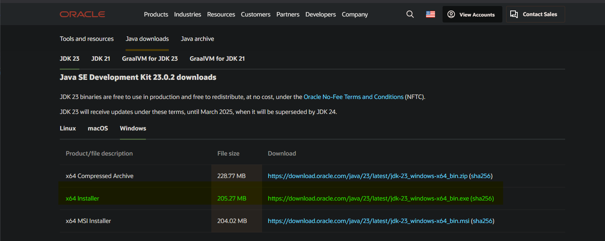
2. Al momento de realizar la instalación, debemos aceptar los cambios que se puedan efectuar sobre las configuraciones del usuario.
3. La instalación es relativamente sencilla, pero debemos recordar y tener presente la ubicación donde se encontrará el JDK, por defecto siempre procura guardarse en la ruta `C:\Programs Files\Java\jdk-23\`.
4. El proceso constará de darle a los botones de `Next` 2 veces y `Close` para terminar la instalación.
5. Podemos hacer una validación inicial de que se haya instalado Java en nuestro equipo, y es usando el comando:

   ```bash
   java --version
   ```

   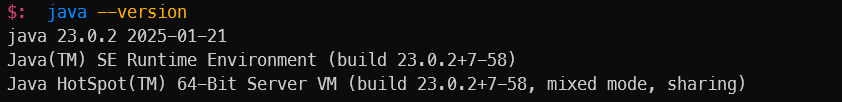

   Lo anterior nos mostrará la versión del JDK, del SE Runtime Environment y del Server VM. En caso de que no aparezca nada del anterior, entonces debemos realizar el siguiente paso de configuración de variables de entorno.

6. Para configurar las variables de entorno del sistema, debemos buscar en Windows `Editar las variables de entorno del sistema`:

   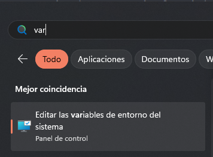

   Dentro de la ventana que se nos abre, buscamos el botón `Variables de entorno` y damos click sobre el mismo.

   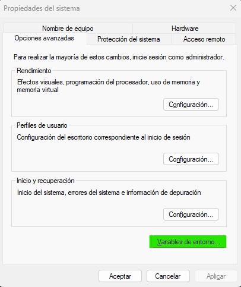

   En la configuración de las variables de entorno del sistema, debemos buscar la llamada `Path` y darle click sobre el mismo. En el listado que aparece al observar su contenido, debemos contar con la siguiente ruta, si no, la agregamos usando el botón de "Nueva" `C:\Program Files\Common Files\Oracle\Java\javapath`

   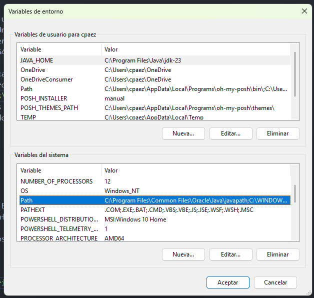

   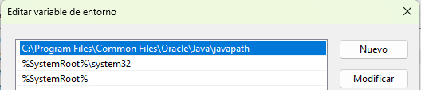

   Adicional, vamos a configurar la variable de usuario llamada `JAVA_HOME`, y el valor a asignar será la ubicación del jdk:

   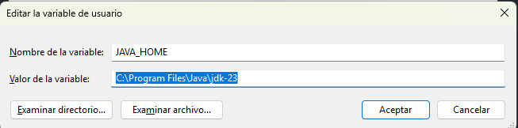

   Ahora, intenta nuevamente con el comando `java --version` para ver si se ha configurado correctamente el entorno de java en tu equipo. Puede ser necesario el reinicio del equipo para que se apliquen los cambios.

## Instalación de Apache NetBeans

Al momento de realizar esta guía, contamos con Apache NetBeans en su versión 24, por lo caul les comparto el enlace de descarga del instalador: [Apache Downloads Mirror](https://www.apache.org/dyn/closer.lua/netbeans/netbeans-installers/24/Apache-NetBeans-24-bin-windows-x64.exe). Si no se inicia la instalación por defecto, entonces debemos hacer click en el primer enlace relacionado en dicha documentación.

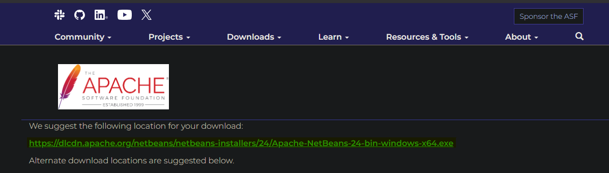

Cuando tengamos descargado el instalador, procedemos a abrir el archivo y seguir los pasos de instalación que se nos presenten:

1. Aceptar que se instalen las herramientas listadas en el frame de instalación
   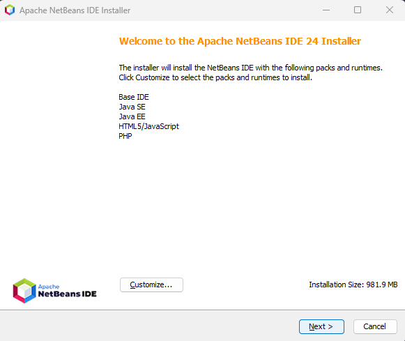
2. Aceptamos la licencia del software
   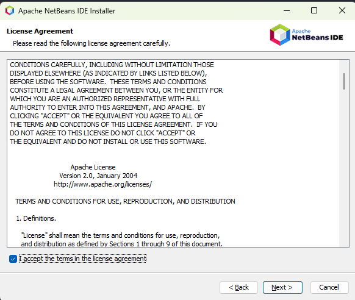
3. Seleccionamos la carpeta donde se guardará el software, y el path de donde obtendrá el JDK de Java (El error que aparece en la imagen es por qué ya cuento con NetBeans instalado)
   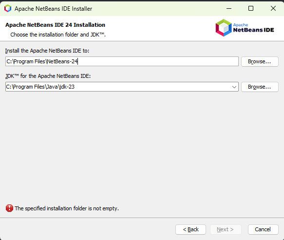

### ¿Y si tengo una instalación y quiero reemplazarla?

Puede que tengamos una versión antigua o simplemente queramos reemplazar la instalación que tengamos actualmente en nuestro equipo, para ello podemos buscar en el ***Panel de Control*** la opción de *Desinstalar un programa*, buscamos a NetBeans y procedemos a desinstalarlo.

Es muy posible que nos salte un error indicándonos que no podemos proseguir con la desinstalación debido a un archivo que está bloqueando el proceso, en cuso caso debemos abrir la ubicación que nos indica el error y manualmente realizar la eliminación del archivo bloqueado.
